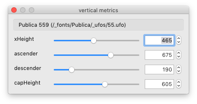
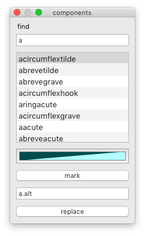

Vertical metrics
----------------

Interactively modify vertical metrics in the current font.

font
: the name of the font

sliders
: adjust individual vertical metrics values interactively

Clear data
----------

Clear groups
: Clear all groups in the current font.

Clear font guidelines
: Clear all font-level guidelines in the current font.

Clear mark colors
: Clear mark colors in all glyphs in the current font.

Clear template glyphs
: Clear all template glyphs in the current font.

Find and replace components
---------------------------

Find and replace all components of a given glyph in the current font.

  

find
: name of the base glyph

references
: a list of glyphs which reference the base glyph in components

mark color
: open the color palette to choose a color

mark
: apply mark color to selected glyphs in the list

new base glyph
: name of a replacement base glyph

replace
: replace base glyph in selected glyphs in the list

