Anchors
-------

### Clear anchors

Remove all anchors in the selected glyphs.

### Create anchors

Create new anchors in the selected glyphs.

  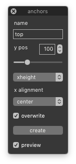

name
: name of the new anchor

y position
: vertical position of the anchor

y reference
: vertical metrics from which the distance is measured

x alignment
: horizontal positioning of the anchor

overwrite
: delete existing anchors with the same name

create
: create anchor in the selected glyphs

preview
: show a preview of the anchor position

Encoding
--------

### Auto unicodes

Automatically set unicodes for the selected glyphs.

### Clear unicodes

Clear all unicodes from selected glyphs.

Glyph Names
-----------

### Rename glyphs

Change the names of the selected glyphs.

  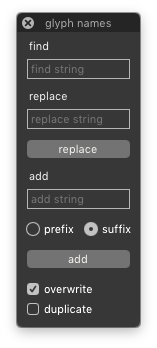

find string
: old string to be replaced

replace string
: new string to replace the old one

replace
: replace the old string with the new one in the names of selected glyphs

add string
: string to be added before or after glyph names

prefix or sufix
: choose whether to add the string before or after the glyph names

add
: add the string to the glyph names

overwrite
: overwrite existing glyphs with new name

duplicate
: rename glyphs as duplicates and keep original glyphs

### Print glyph names

Print the names of selected glyphs in different formats.

  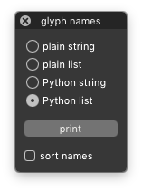

mode
: choose one of the available output modes

print
: print the names of the selected glyphs to the Output Window

sort names
: sort the glyph names alphabetically

Guidelines
----------

### Clear guidelines

Delete all glyph-level guidelines in the selected glyphs.

Interpolation
-------------

### Condensomatic

Generate condensed glyphs into the current font by interpolating Bold and Regular masters.

  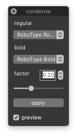

regular and bold
: two compatible masters corresponding to Regular and Bold weights

factor
: the condensing factor

apply
: generate condensed contours into the selected glyphs by interpolation

preview
: show a preview of the result in the background

<!--
### Interpolate steps

Interpolate steps between two selected glyphs in the current font.

    

prefix
: glyph name prefix for the interpolation results

inter steps
: number of interpolation steps

extra steps
: number of extrapolation steps

clear glyphs
: clear existing results before interpolation

interpolate
: interpolate steps between the master glyphs

  

-->

### Interpolate masters

Interpolate two masters into the selected glyphs of the current font.

  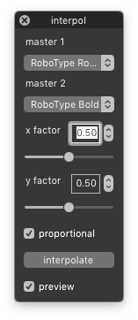

master 1 and master 2
: select two compatible master fonts

x factor and y factor
: horizontal and vertical interpolation factors

proportional
: keep x/y factors equal

interpolate
: interpolate master glyphs into the selected glyphs

preview
: show a preview of the result in the background

Layers
------

### Import layer

Import glyphs from an external font into a new layer of the current font.

  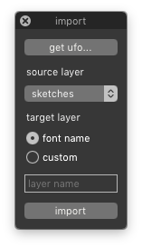

 
get ufo
: select UFO font from which to import glyphs

source layer
: layer of the source font from which the glyphs will be imported

target layer
: use the font name as the layer name, or define a custom name

import
: import glyphs from the external UFO into a new layer

### Mask

Quickly copy and flip between a main layer and a mask layer in the selected glyphs.

    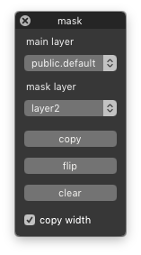

main layer
: select the main layer

mask layer
: select another layer as the mask layer

copy
: copy the contents of the main layer to the mask layer

flip
: flip the contents between main and mask layers

clear
: clear the contents of the mask layer

lock widths
: copy glyph widths when copying between layers

Mark colors
-----------

### Mark select

Choose and apply mark colors to selected glyphs, and select glyphs based on their mark color.

  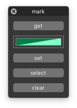

get
: get color from selected glyph

color
: open the color palette to choose a color

set
: mark selected glyphs with the current color

select
: select all glyphs marked with the current color

clear
: clear mark color in selected glyphs

Metrics
-------

### Center glyph

Center glyph contours by equalizing left and right margins.

### Copy margins

Copy left/right margins from selected glyphs to the same glyphs in another font or layer.

  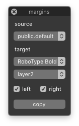

source
: source layer in the current font

target
: destination font and layer

left and right
: select which margins will be copied

copy
: copy margins from source glyphs to the target layer

### Copy width

Copy widths from selected glyphs to the same glyphs in another font or layer.

    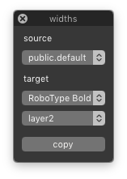

source
: source layer in the current font

target
: destination font and layer

copy
: copy widths from source glyphs to the target layer

### Set margins

Set left/right margins in the selected glyphs.

  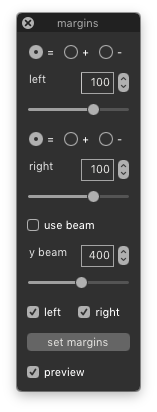

left and right
: values for left and right margin adjustments

mode
: how the value will be applied to the margin

use beam
: optionally use the beam to set the margins

y beam
: define the vertical position of the beam

apply
: set margins in the selected glyphs

preview
: show a preview of the result in the background

### Set width

Set the advance width in selected glyphs.

  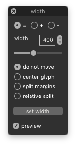

width
: value for width adjustment

mode
: how the value will be applied to the width

position
: choose the positioning mode for the glyph’s contours

apply
: set width value in the selected glyphs

preview
: show a preview of the result in the background

Modifiers
---------

### Select layers

Select which layers of the font will be affected by other tools.

    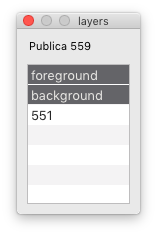

font name
: the name of the current font

layers
: list of layers in the font

Transform
---------

### Gridfit

Align different glyph parts to a given grid size.

    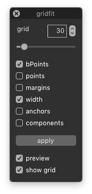

grid
: the size of the grid

glyph parts
: choose which glyph parts to align

apply
: fit glyph parts to grid in selected glyphs

preview
: show a preview of the result

show grid
: toggle the grid display

### Move

Move the contents of selected glyphs.

  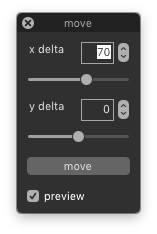

delta x and delta y
: horizontal and vertical move distances

apply
: move the selected glyphs

preview
: show a preview of the result in the background

### Rotate

Rotate selected glyphs.

  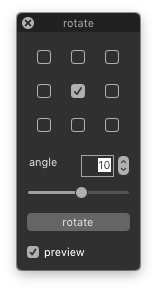

origin
: origin point for the transformation

angle
: the angle of rotation in degrees

apply
: rotate the selected glyphs

preview
: show a preview of the result in the background

### Scale

Scale the selected glyphs.

  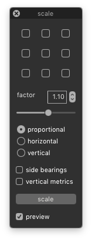

origin
: origin point for the transformation

factor
: the scaling factor

dimensions
: choose between proportional, horizontal or vertical scaling

sidebearings
: scale left and right margins too

vertical metrics
: scale the font’s vertical metrics

apply
: scale the selected glyphs

preview
: show a preview of the result in the background

### Shift

Shift points above/below a certain position in the selected glyphs.

  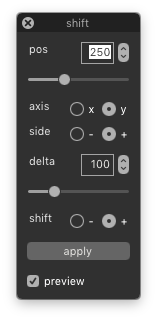

position
: the selection threshold position

axis
: the selection axis

side
: select points above or below the threshold value

shift
: direction of the shift

apply
: select and shift points in the selected glyphs

preview
: show a preview of the result in the background

### Skew

Skew the selected glyphs.

  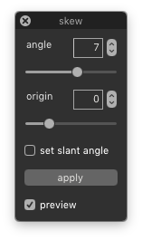

angle
: the skew angle

origin
: vertical origin of the transformation

set slant angle
: set the angle in the font info

apply
: skew the selected glyphs

preview
: show a preview of the result in the background

