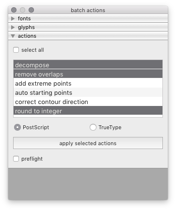
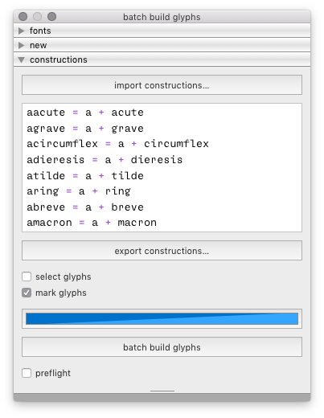
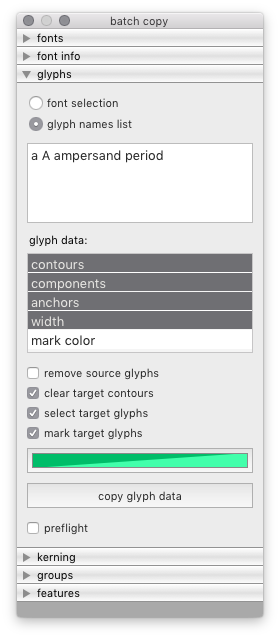
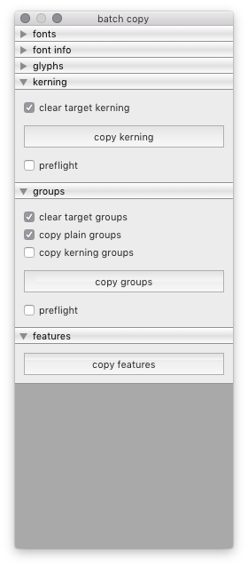
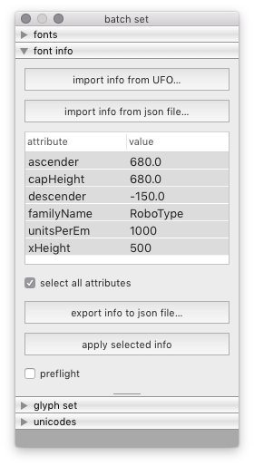
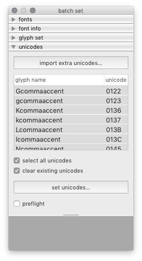

Tools in the *batch* menu
=========================

back to [index](index.html)

Batch tools apply one or more actions to several fonts at once. Both open and closed fonts are supported. Some Batch tools can import/export data to text files.

All Batch tools are built using the Accordion View, with controls and settings grouped in collapsible sections (panes). The first pane of all Batch tools is the font selection pane. Other panes offer additional action settings and buttons to apply actions.

Batch tools provide no visual feedback for changes in the fonts, so it’s important to backup your data and make tests before applying a transformation to many fonts. All Batch tools include a preflight function to test the current settings without actually applying the changes.

actions
-------

Apply glyph actions in batch to selected fonts.

build glyphs
------------

Create new glyphs in the selected fonts.

clear data
----------

copy data
---------

find & replace info
-------------------

...

set style data
--------------

...

set data
--------

