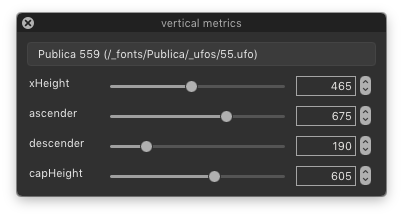
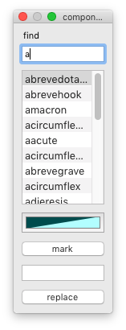

Tools in the *font* menu
========================

back to [index](index.html)

## Vertical metrics

Interactively modify vertical metrics in the current font.

<dl>
<dt>font
<dd>the name of the font
<dt>sliders
<dd>adjust individual vertical metrics values interactively
</dl>

## Clear mark colors

Clear mark colors in all glyphs in the current font.

## Clear font guidelines

Clear all font-level guidelines in the current font.

## Find and replace components

Find and replace all components of a given glyph in the current font.

  

    
  

  

    <dl>
      <dt>find
      <dd>name of the base glyph
      <dt>references
      <dd>a list of glyphs which reference the base glyph in components
      <dt>mark color
      <dd>open the color palette to choose a color
      <dt>mark
      <dd>apply mark color to selected glyphs in the list
      <dt>new base glyph
      <dd>name of a replacement base glyph
      <dt>replace
      <dd>replace base glyph in selected glyphs in the list
    </dl>
  

