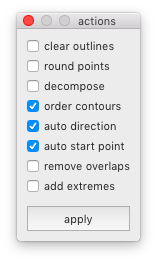
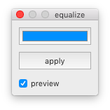
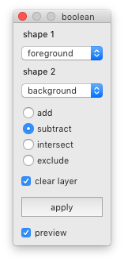
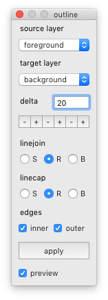
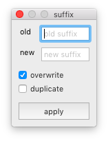
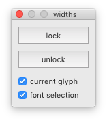
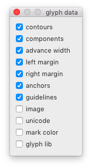

Tools in the *glyphs* menu
==========================

back to [index](index.html)

<ul class='toctree'>
  <li><label for="anchors">Anchors</label><input id="anchors" name="anchors" type="checkbox" />
    <ul>
      <li><a href="#clear-achors">Clear anchors</a></li>
      <li><a href="#create-anchors">Create anchors</a></li>
    </ul>
  </li>
  <li><label for="components">Components</label><input id="components" name="components" type="checkbox" />
    <ul>
      <li><a href='#clear-components'>Clear components</a></li>
      <li><a href='#find-component'>Find component</a></li>
      <li><a href='#replace-component'>Replace component</a></li>
    </ul>
  </li>
  <li><label for="contours">Contours</label><input id="contours" name="contours" type="checkbox" />
    <ul>
      <li><a href="#actions">Actions</a></li>
      <li><a href="#balance-handles">Balance handles</a></li>
      <li><a href="#boolean-operations">Boolean operations</a></li>
      <li><a href="#curves-to-lines">Curves to lines</a></li>
      <li><a href="#gridfit">Gridfit</a></li>
      <li><a href="#outline">Outline</a></li>
    </ul>
  </li>
  <li><label for="encoding">Encoding</label><input id="encoding" name="encoding" type="checkbox" />
    <ul>
      <li><a href="#clear-unicodes">Clear unicodes</a></li>
      <li><a href="#auto-unicodes">Auto unicodes</a></li>
    </ul>
  </li>
  <li><label for="glyphnames">Glyph names</label><input id="glyphnames" name="names" type="checkbox" />
    <ul>
      <li><a href="print">Print</a></li>
      <li><a href="#change-suffix">Change suffix</a></li>
    </ul>
  </li>
  <li><label for="guidelines">Guidelines</label><input id="guidelines" name="names" type="checkbox" />
    <ul>
      <li><a href="#clear-guidelines">Clear guides</a></li>
    </ul>
  </li>
  <li><label for="interpolation">Interpolation</label><input id="interpolation" name="interpolation" type="checkbox" />
    <ul>
      <li><a href="#interpolate-in-font">Interpolate in font</a></li>
      <li><a href="#interpolate-masters">Interpolate masters</a></li>
      <li><a href="#condensomatic">Condensomatic</a></li>
    </ul>
  </li>
  <li><label for="transform">Transform</label><input id="transform" name="transform" type="checkbox" />
    <ul>
      <li><a href="#scale">Scale</a></li>
      <li><a href="#move">Move</a></li>
      <li><a href="#skew">Skew</a></li>
      <li><a href="#rotate">Rotate</a></li>
      <li><a href="#shift-points">Shift points</a></li>
    </ul>
  </li>
  <li><label for="modifiers">Modifiers</label><input id="modifiers" name="modifiers" type="checkbox" />
    <ul>
      <li><a href="#layers">Layers</a></li>
      <li><a href="#glyph-data">Glyph data</a></li>
    </ul>
  </li>
</ul>

Anchors
-------

### Clear anchors

Delete all anchors in the selected glyphs. (script)

### Create anchors

Create an anchor in the selected glyphs.

  

    
  

  

    <dl>
      <dt>name
      <dd>name of the new anchor
      <dt>y pos
      <dd>vertical position of the anchor
      <dt>from xheight
      <dd>measure distance in relation to the xheight
      <dt>x alignment
      <dd>horizontal positioning of the anchor
      <dt>create
      <dd>create anchor in the selected glyphs
    </dl>
  

Components
----------

### Clear components

...

### Find component

...

### Replace component

...

Contours
--------

### Actions

Apply common actions to selected glyphs.

  

    
  

  

    <dl>
      <dt>actions
      <dd>choose one or more actions
      <dt>apply
      <dd>apply selected actions to selected glyphs
    </dl>
  

### Balance handles

Balance the lengths of BCP handles.

  

    
  

  

    <dl>
      <dt>apply
      <dd>equalize all BCP handles in the selected glyphs
      <dt>preview
      <dd>show a preview of the result in the Glyph Editor
    </dl>
  

### Boolean operations

Perform boolean path operation between two glyphs.

  

    
  

  

    <dl>
      <dt>shape 1 and shape 2
      <dd>select two layers
      <dt>operation
      <dd>select the boolean mode
      <dt>clear layer
      <dd>clear layer contents before performing operation
      <dt>apply
      <dd>perform boolean operation between layers in selected glyphs
      <dt>preview
      <dd>show a preview of the result in the Glyph Editor
    </dl>
  

### Curves to lines

Convert all curve segments to line segments. (script)

### Gridfit

Align different glyph parts to a given grid size.

  

    
  

  

    <dl>
      <dt>glyph parts
      <dd>select which glyph parts to fit
      <dt>apply
      <dd>fit glyph parts to grid in selected glyphs
      <dt>preview
      <dd>show a preview of the result in the Glyph Editor
      <dt>show grid
      <dd>toggle the grid layer in the Glyph Editor
    </dl>
  

### Outline

Apply an outline to the glyph’s contours.

  

    
  

  

    <dl>
      <dt>source layer and target layer
      <dd>...
      <dt>delta
      <dd>define the distance of the calculated outline stroke
      <dt>linejoin and linecap
      <dd>select outline stroke properties
    </dl>
  

Encoding
--------

### Auto unicodes

Automatically set unicodes for selected glyphs. (script)

### Clear unicodes

Clear all unicodes from selected glyphs. (script)

Glyph Names
-----------

### Print names

Print the names of selected glyphs in different formats.

  

    
  

  

    <dl>
      <dt>mode
      <dd>choose one of the available output modes
      <dt>print
      <dd>print the names of the selected glyphs to the Output Window
      <dt>sort names
      <dd>sort the glyph names alphabetically
    </dl>
  

### Change suffix

Change the suffix in the names of selected glyphs.

  

    
  

  

    <dl>
      <dt>old and new
      <dd>old and new glyph name suffixes
      <dt>overwrite
      <dd>overwrite existing glyphs with new name
      <dt>duplicate
      <dd>keep original glyphs with old name
    </dl>
  

Guidelines
----------

### Clear guidelines

Delete all glyph-level guidelines in the selected glyphs. (script)

Interpolation
-------------

### Interpolate in font

Interpolate steps between two selected glyphs in the current font.

  

    
  

  

    <dl>
      <dt>glyph prefix
      <dd>define a prefix for the names of interpolated glyphs
      <dt>inter
      <dd>define the number of interpolation steps
      <dt>extra
      <dd>define the number of extrapolation steps
      <dt>clear glyphs
      <dd>clear the existing glyphs before interpolation
      <dt>interpolate
      <dd>interpolate steps between the two selected glyphs in the current font
    </dl>
  

### Interpolate masters

Interpolate two master fonts into the selected glyphs of the current font.

  

    
  

  

    <dl>
      <dt>master 1 and master 2
      <dd>select master fonts
      <dt>x factor and x factor
      <dd>define horizontal and vertical interpolation factors
      <dt>proportional
      <dd>keep x/y factors equal
      <dt>apply
      <dd>interpolate master glyphs into the selected glyphs of the current font
      <dt>preview
      <dd>show a preview of the result in the background
    </dl>
  

### Condensomatic

Generate condensed glyphs into the selected glyphs of the current font by interpolating Bold and Regular masters.

  

    
  

  

    <dl>
      <dt>regular and bold
      <dd>choose two master fonts corresponding to Regular and Bold styles
      <dt>factor
      <dd>set the condensing factor
      <dt>apply
      <dd>create condensed glyphs into the selected glyphs of the current font
      <dt>preview
      <dd>show a preview of the result in the background
    </dl>
  

Layers
------

### Import

Import glyphs from an external UFO into a new layer of the current font.

  

    
  

  

    <dl>
      <dt>get ufo
      <dd>select a UFO font from which to import glyphs
      <dt>source layer
      <dd>choose from which layer of the source font the glyphs should be imported
      <dt>target layer
      <dd>use the font name as the new layer name, or define a custom name for the new layer
      <dt>import
      <dd>import glyphs from an external UFO into a new layer of the selected glyphs in the current font
    </dl>
  

### Lock widths

Keeps the widths of different glyph layers locked or unlocked.

  

    
  

  

    <dl>
      <dt>lock
      <dd>keep layer widths locked
      <dt>unlock
      <dd>keep layer widths independent
    </dl>
  

### Mask

Quickly copy and flip between a main layer and a mask layer in the selected glyphs.

  

    
  

  

    <dl>
      <dt>main layer
      <dd>select the main layer
      <dt>mask layer
      <dd>select another layer as the mask layer
      <dt>copy
      <dd>copy selected glyphs from the main layer to the mask layer
      <dt>flip
      <dd>flip the contents of the main and mask layers
      <dt>clear
      <dd>clear the contents of the mask layer
      <dt>lock widths
      <dd>copy glyph widths when copying between layers
    </dl>
  

Mark colors
-----------

### Mark select

Choose and apply mark colors to selected glyphs, and select glyphs based on their mark color.

  

    
  

  

    <dl>
      <dt>get
      <dd>get color from selected glyph
      <dt>color
      <dd>open the color wheel to choose a color
      <dt>set
      <dd>mark the selected glyphs with the current color
      <dt>select
      <dd>select all glyphs marked with the current color
      <dt>clear
      <dd>clear mark color in selected glyphs
    </dl>
  

Metrics
-------

### Center glyphs

Make the left and right margins of a glyph equal. (script)

### Set margins

Set left and/or right margins in the selected glyphs.

  

    
  

  

    <dl>
      <dt>left and right
      <dd>define values for left and right margins
      <dt>mode
      <dd>choose how the value will be applied to the margin
      <dt>use beam
      <dd>use the beam to set margins
      <dt>y beam
      <dd>define the vertical position of the beam
      <dt>apply
      <dd>set margin values in the selected glyphs
      <dt>preview
      <dd>show a preview of the result in the background
    </dl>
  

### Copy margins

Copy left and/or right margins from selected glyphs in the current font to the same glyphs in another font or layer.

  

    
  

  

    <dl>
      <dt>source
      <dd>select the source layer in the current font
      <dt>target
      <dd>select the destination font and layer
      <dt>left and right
      <dd>define which margins will be copied
      <dt>copy
      <dd>copy the margins from source glyphs to the target layer
    </dl>
  

### Set width

Set a width in the selected glyphs.

  

    
  

  

    <dl>
      <dt>width
      <dd>define values for width
      <dt>mode
      <dd>choose how the value will be applied to the width
      <dt>position
      <dd>choose the positioning mode for the glyph’s contours
      <dt>apply
      <dd>set width value in the selected glyphs
      <dt>preview
      <dd>show a preview of the result in the background
    </dl>
  

### Copy width

Copy width from selected glyphs in the current font to the same glyphs in another font or layer.

  

    
  

  

    <dl>
      <dt>source
      <dd>select the source layer in the current font
      <dt>target
      <dd>select the destination font and layer
      <dt>copy
      <dd>copy the margins from source glyphs to the target layer
    </dl>
  

Transform
---------

### Move

Move the contents of selected glyphs.

  

    
  

  

    <dl>
      <dt>delta x and delta y
      <dd>define the horizontal and vertical move distances
      <dt>apply
      <dd>move the selected glyphs
      <dt>preview
      <dd>show a preview of the result in the background
    </dl>
  

### Scale

Scale the selected glyphs.

  

    
  

  

    <dl>
      <dt>origin
      <dd>select the origin point for the transformation
      <dt>factor
      <dd>define the scale factor
      <dt>dimensions
      <dd>choose scale dimensions
      <dt>sidebearings
      <dd>scale left and right margins
      <dt>vertical metrics
      <dd>scale the font’s vertical metrics
      <dt>apply
      <dd>scale the selected glyphs
      <dt>preview
      <dd>show a preview of the result in the background
    </dl>
  

### Skew

Skew the selected glyphs.

  

    
  

  

    <dl>
      <dt>angle
      <dd>...
      <dt>origin
      <dd>...
      <dt>set slant angle
      <dd>...
      <dt>apply
      <dd>...
      <dt>preview
      <dd>...
    </dl>
  

### Rotate

Rotate selected glyphs.

  

    
  

  

    <dl>
      <dt>origin
      <dd>...
      <dt>angle
      <dd>...
      <dt>apply
      <dd>...
      <dt>preview
      <dd>...
    </dl>
  

### Shift points

Shift selected points.

  

    
  

  

    <dl>
      <dt>position
      <dd>...
      <dt>axis
      <dd>...
      <dt>side
      <dd>...
      <dt>shift
      <dd>...
      <dt>apply
      <dd>...
      <dt>preview
      <dd>...
    </dl>
  

Modifiers
---------

### Layers

Select which layers of the selected glyphs will be affected by other glyphs tools.

  

    
  

  

    <dl>
      <dt>font name
      <dd>...
      <dt>layers
      <dd>...
    </dl>
  

### Glyph data

Select which types of glyph data will be affected by other glyphs tools.

  

    
  

  

    <dl>
      <dt>glyph data
      <dd>...
    </dl>
  

