Tools in the *glyphs* menu
==========================

back to [index](index.html)

<ul class='toctree'>
  <!-- anchors -->
  <li><label for="anchors">Anchors</label><input id="anchors" name="anchors" type="checkbox" />
    <ul>
      <li><a href="#clear-anchors">Clear anchors</a></li>
      <li><a href="#create-anchors">Create anchors</a></li>
    </ul>
  </li>
  <!-- encoding -->
  <li><label for="encoding">Encoding</label><input id="encoding" name="encoding" type="checkbox" />
    <ul>
      <li><a href="#auto-unicodes">Auto unicodes</a></li>
      <li><a href="#clear-unicodes">Clear unicodes</a></li>
    </ul>
  </li>
  <!-- glyph names -->
  <li><label for="glyphnames">Glyph names</label><input id="glyphnames" name="names" type="checkbox" />
    <ul>
      <li><a href="#rename-glyphs">Rename glyphs</a></li>
      <li><a href="#print-glyph-names">Print glyph names</a></li>
    </ul>
  </li>
  <!-- guidelines -->
  <li><label for="guidelines">Guidelines</label><input id="guidelines" name="names" type="checkbox" />
    <ul>
      <li><a href="#clear-guidelines">Clear guides</a></li>
    </ul>
  </li>
  <!-- interpolation -->
  <li><label for="interpolation">Interpolation</label><input id="interpolation" name="interpolation" type="checkbox" />
    <ul>
      <li><a href="#condensomatic">Condensomatic</a></li>
      <li><a href="#interpolate-masters">Interpolate masters</a></li>
    </ul>
  </li>
  <!-- layers -->
  <li><label for="layers">Layers</label><input id="layers" name="names" type="checkbox" />
    <ul>
      <li><a href="#import-layer">Import layer</a></li>
      <li><a href="#mask">Mask</a></li>
    </ul>
  </li>
  <!-- mark colors -->
  <li><label for="mark-colors">Mark colors</label><input id="mark-colors" name="mark-colors" type="checkbox" />
    <ul>
      <li><a href="#mark-select">Mark select</a></li>
    </ul>
  </li>
  <!-- metrics -->
  <li><label for="metrics">Metrics</label><input id="metrics" name="metrics" type="checkbox" />
    <ul>
      <li><a href="#center-glyph">Center glyph</a></li>
      <li><a href="#copy-margins">Copy margins</a></li>
      <li><a href="#copy-width">Copy width</a></li>
      <li><a href="#set-margins">Set margins</a></li>
      <li><a href="#set-width">Set width</a></li>
    </ul>
  </li>
  <!-- modifiers -->
  <li><label for="modifiers">Modifiers</label><input id="modifiers" name="modifiers" type="checkbox" />
    <ul>
      <li><a href="#select-layers">Select layers</a></li>
    </ul>
  </li>
  <!-- transform -->
  <li><label for="transform">Transform</label><input id="transform" name="transform" type="checkbox" />
    <ul>
      <li><a href="#gridfit">Gridfit</a></li>
      <li><a href="#move">Move</a></li>
      <li><a href="#rotate">Rotate</a></li>
      <li><a href="#scale">Scale</a></li>
      <li><a href="#shift">Shift</a></li>
      <li><a href="#skew">Skew</a></li>
    </ul>
  </li>
</ul>

Anchors
-------

### Clear anchors

Remove all anchors in the selected glyphs.

### Create anchors

Create new anchors in the selected glyphs.

  

    
  

  

    <dl>
      <dt>name
      <dd>name of the new anchor
      <dt>y position
      <dd>vertical position of the anchor
      <dt>y reference
      <dd>vertical metrics from which the distance is measured
      <dt>x alignment
      <dd>horizontal positioning of the anchor
      <dt>overwrite
      <dd>delete existing anchors with the same name
      <dt>create
      <dd>create anchor in the selected glyphs
      <dt>preview
      <dd>show a preview of the anchor position
    </dl>
  

Encoding
--------

### Auto unicodes

Automatically set unicodes for the selected glyphs.

### Clear unicodes

Clear all unicodes from selected glyphs.

Glyph Names
-----------

### Rename glyphs

Change the names of the selected glyphs.

  

    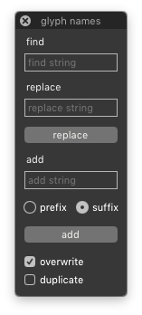
  

  

    <dl>
      <dt>find string
      <dd>old string to be replaced
      <dt>replace string
      <dd>new string to replace the old one
      <dt>replace
      <dd>replace the old string with the new one in the names of selected glyphs
      <dt>add string
      <dd>string to be added before or after glyph names
      <dt>prefix or sufix
      <dd>choose whether to add the string before or after the glyph names
      <dt>add
      <dd>add the string to the glyph names
      <dt>overwrite
      <dd>overwrite existing glyphs with new name
      <dt>duplicate
      <dd>rename glyphs as duplicates and keep original glyphs
    </dl>
  

### Print glyph names

Print the names of selected glyphs in different formats.

  

    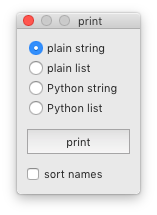
  

  

    <dl>
      <dt>mode
      <dd>choose one of the available output modes
      <dt>print
      <dd>print the names of the selected glyphs to the Output Window
      <dt>sort names
      <dd>sort the glyph names alphabetically
    </dl>
  

Guidelines
----------

### Clear guidelines

Delete all glyph-level guidelines in the selected glyphs.

Interpolation
-------------

### Condensomatic

Generate condensed glyphs into the current font by interpolating Bold and Regular masters.

  

    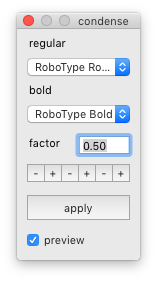
  

  

    <dl>
      <dt>regular and bold
      <dd>two compatible masters corresponding to Regular and Bold weights
      <dt>factor
      <dd>the condensing factor
      <dt>apply
      <dd>generate condensed contours into the selected glyphs by interpolation
      <dt>preview
      <dd>show a preview of the result in the background
    </dl>
  

<!--
### Interpolate steps

Interpolate steps between two selected glyphs in the current font.

  

    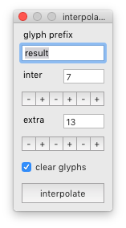
  

  

    <dl>
      <dt>prefix
      <dd>glyph name prefix for the interpolation results
      <dt>inter steps
      <dd>number of interpolation steps
      <dt>extra steps
      <dd>number of extrapolation steps
      <dt>clear glyphs
      <dd>clear existing results before interpolation
      <dt>interpolate
      <dd>interpolate steps between the master glyphs
    </dl>
  

-->

### Interpolate masters

Interpolate two masters into the selected glyphs of the current font.

  

    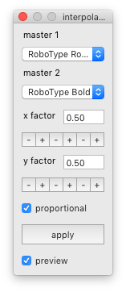
  

  

    <dl>
      <dt>master 1 and master 2
      <dd>select two compatible master fonts
      <dt>x factor and y factor
      <dd>horizontal and vertical interpolation factors
      <dt>proportional
      <dd>keep x/y factors equal
      <dt>interpolate
      <dd>interpolate master glyphs into the selected glyphs
      <dt>preview
      <dd>show a preview of the result in the background
    </dl>
  

Layers
------

### Import layer

Import glyphs from an external font into a new layer of the current font.

  

    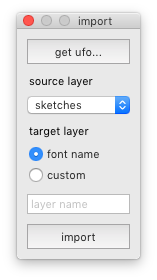
  

  
 
    <dl>
      <dt>get ufo
      <dd>select UFO font from which to import glyphs
      <dt>source layer
      <dd>layer of the source font from which the glyphs will be imported
      <dt>target layer
      <dd>use the font name as the layer name, or define a custom name
      <dt>import
      <dd>import glyphs from the external UFO into a new layer
    </dl>
  

### Mask

Quickly copy and flip between a main layer and a mask layer in the selected glyphs.

  

    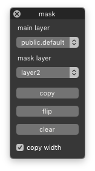
  

  

    <dl>
      <dt>main layer
      <dd>select the main layer
      <dt>mask layer
      <dd>select another layer as the mask layer
      <dt>copy
      <dd>copy the contents of the main layer to the mask layer
      <dt>flip
      <dd>flip the contents between main and mask layers
      <dt>clear
      <dd>clear the contents of the mask layer
      <dt>lock widths
      <dd>copy glyph widths when copying between layers
    </dl>
  

Mark colors
-----------

### Mark select

Choose and apply mark colors to selected glyphs, and select glyphs based on their mark color.

  

    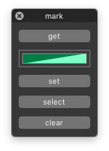
  

  

    <dl>
      <dt>get
      <dd>get color from selected glyph
      <dt>color
      <dd>open the color palette to choose a color
      <dt>set
      <dd>mark selected glyphs with the current color
      <dt>select
      <dd>select all glyphs marked with the current color
      <dt>clear
      <dd>clear mark color in selected glyphs
    </dl>
  

Metrics
-------

### Center glyph

Center glyph contours by equalizing left and right margins.

### Copy margins

Copy left/right margins from selected glyphs to the same glyphs in another font or layer.

  

    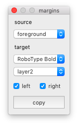
  

  

    <dl>
      <dt>source
      <dd>source layer in the current font
      <dt>target
      <dd>destination font and layer
      <dt>left and right
      <dd>select which margins will be copied
      <dt>copy
      <dd>copy margins from source glyphs to the target layer
    </dl>
  

### Copy width

Copy widths from selected glyphs to the same glyphs in another font or layer.

  

    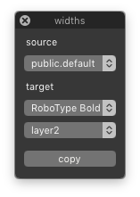
  

  

    <dl>
      <dt>source
      <dd>source layer in the current font
      <dt>target
      <dd>destination font and layer
      <dt>copy
      <dd>copy widths from source glyphs to the target layer
    </dl>
  

### Set margins

Set left/right margins in the selected glyphs.

  

    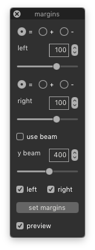
  

  

    <dl>
      <dt>left and right
      <dd>values for left and right margin adjustments
      <dt>mode
      <dd>how the value will be applied to the margin
      <dt>use beam
      <dd>optionally use the beam to set the margins
      <dt>y beam
      <dd>define the vertical position of the beam
      <dt>apply
      <dd>set margins in the selected glyphs
      <dt>preview
      <dd>show a preview of the result in the background
    </dl>
  

### Set width

Set the advance width in selected glyphs.

  

    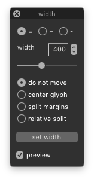
  

  

    <dl>
      <dt>width
      <dd>value for width adjustment
      <dt>mode
      <dd>how the value will be applied to the width
      <dt>position
      <dd>choose the positioning mode for the glyph’s contours
      <dt>apply
      <dd>set width value in the selected glyphs
      <dt>preview
      <dd>show a preview of the result in the background
    </dl>
  

Modifiers
---------

### Select layers

Select which layers of the font will be affected by other tools.

  

    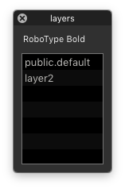
  

  

    <dl>
      <dt>font name
      <dd>the name of the current font
      <dt>layers
      <dd>list of layers in the font
    </dl>
  

Transform
---------

### Gridfit

Align different glyph parts to a given grid size.

  

    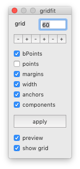
  

  

    <dl>
      <dt>grid
      <dd>the size of the grid
      <dt>glyph parts
      <dd>choose which glyph parts to align
      <dt>apply
      <dd>fit glyph parts to grid in selected glyphs
      <dt>preview
      <dd>show a preview of the result
      <dt>show grid
      <dd>toggle the grid display
    </dl>
  

### Move

Move the contents of selected glyphs.

  

    
  

  

    <dl>
      <dt>delta x and delta y
      <dd>horizontal and vertical move distances
      <dt>apply
      <dd>move the selected glyphs
      <dt>preview
      <dd>show a preview of the result in the background
    </dl>
  

### Rotate

Rotate selected glyphs.

  

    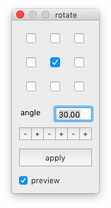
  

  

    <dl>
      <dt>origin
      <dd>origin point for the transformation
      <dt>angle
      <dd>the angle of rotation in degrees
      <dt>apply
      <dd>rotate the selected glyphs
      <dt>preview
      <dd>show a preview of the result in the background
    </dl>
  

### Scale

Scale the selected glyphs.

  

    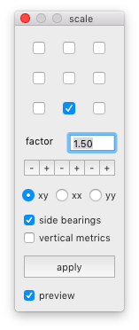
  

  

    <dl>
      <dt>origin
      <dd>origin point for the transformation
      <dt>factor
      <dd>the scaling factor
      <dt>dimensions
      <dd>choose between proportional, horizontal or vertical scaling
      <dt>sidebearings
      <dd>scale left and right margins too
      <dt>vertical metrics
      <dd>scale the font’s vertical metrics
      <dt>apply
      <dd>scale the selected glyphs
      <dt>preview
      <dd>show a preview of the result in the background
    </dl>
  

### Shift

Shift points above/below a certain position in the selected glyphs.

  

    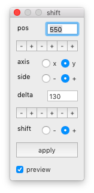
  

  

    <dl>
      <dt>position
      <dd>the selection threshold position
      <dt>axis
      <dd>the selection axis
      <dt>side
      <dd>select points above or below the threshold value
      <dt>shift
      <dd>direction of the shift
      <dt>apply
      <dd>select and shift points in the selected glyphs
      <dt>preview
      <dd>show a preview of the result in the background
    </dl>
  

### Skew

Skew the selected glyphs.

  

    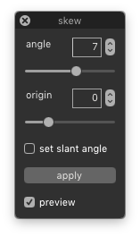
  

  

    <dl>
      <dt>angle
      <dd>the skew angle
      <dt>origin
      <dd>vertical origin of the transformation
      <dt>set slant angle
      <dd>set the angle in the font info
      <dt>apply
      <dd>skew the selected glyphs
      <dt>preview
      <dd>show a preview of the result in the background
    </dl>
  

