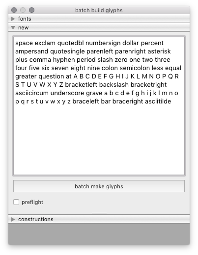

=====
build
=====

The Build tool is a batch tool to create new glyphs in a set of target fonts. It can be used to create new empty glyphs, and to build new glyphs from components using `Glyph Construction`_ syntax.

.. image:: _imgs/BatchBuild_2.png

**fonts**

Use the *fonts* panel to select on which fonts to apply the actions.

**new**

Use the *new* panel to create new empty glyphs from a list of glyph names.

**constructions**

Use the *constructions* panel to build new glyphs from a list of glyph constructions.

.. _Glyph Construction: http://github.com/typemytype/glyphconstruction

----

.. automodule:: hTools3.dialogs.batch.build
