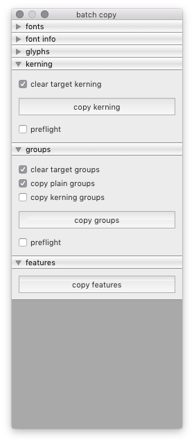

====
copy
====

The Copy tool is batch tool to copy data from one source font to a set of target fonts.

.. image:: _imgs/BatchCopy_1.png
.. image:: _imgs/BatchCopy_2.png

**fonts**

Use the *fonts* panel to select the source font and the target fonts.

**font info**

Use the *font info* panel to select font info attributes to copy data from the source font to the target fonts.

**glyphs**

Use the *glyphs* panel to adjust settings and copy glyph data from the source font to the target fonts.

**kerning**

Use the *kerning* panel to copy kerning data from the source font to the target fonts.

**groups**

Use the *groups* panel to copy groups data from the source font to the target fonts.

**features**

Use the *features* panel to copy OpenType feature code from the source font to the target fonts.

----

.. automodule:: hTools3.dialogs.batch.copy
