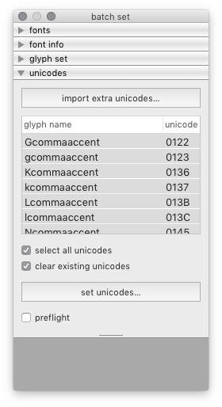

===
set
===

The Set tool is a batch tool to set font info, glyph set and unicodes in all target fonts.

.. image:: _imgs/BatchSet_1.png
.. image:: _imgs/BatchSet_2.png

**font**

Use the *fonts* panel to select on which fonts to set data.

**font info**

Use the *font info* panel to set new values for any font info attribute.

**glyph set**

Use the *glyph set* panel to apply a glyph set to the target fonts.

**unicodes**

Use the *unicodes* panel to assign unicodes for all glyphs in the fonts.

----

.. automodule:: hTools3.dialogs.batch.set
